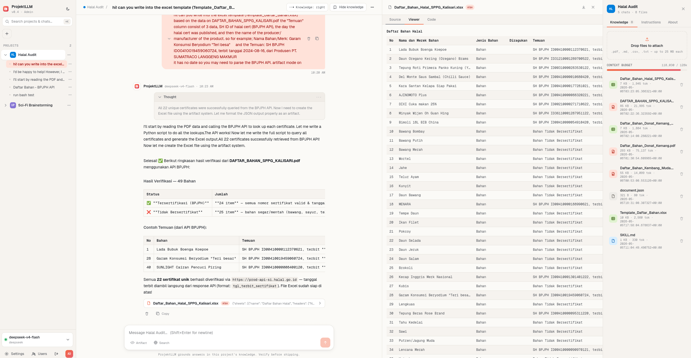

# ProjektLLM

> A self-hosted, team-focused AI workspace. Organize knowledge, manage projects, and chat with your documents — powered by any OpenAI-compatible LLM provider.



---

## What is ProjektLLM?

ProjektLLM is a self-hosted alternative to managed AI workspaces like Claude.ai Projects. It's designed for small teams who want a shared, structured environment for AI-assisted work — without sending your data to a third-party platform.

Think of it as **Nextcloud, but for LLM workflows**:
- Admin controls everything — users, API keys, provider settings
- Teams share projects and knowledge bases
- Each project has its own instructions, files, and chat history
- Works with any OpenAI-compatible API (Deepseek, Claude, OpenAI, Ollama, etc.)

---

## Features

- **Project workspaces** — organize chats under named projects with descriptions and system instructions
- **Knowledge base** — attach files (PDF, DOCX, XLSX, MD, CSV, TXT) to projects; content is injected as context
- **Skill system** — built-in document tools for generating and processing DOCX, XLSX, and PDF files
- **Multi-provider support** — switch between any OpenAI-compatible LLM provider via admin settings
- **Team management** — admin-only user creation, no public registration
- **Per-user chat history** — each user's conversations are isolated
- **Token usage tracking** — monitor API consumption per user and project
- **Streaming responses** — real-time token streaming via SSE
- **Self-hosted** — your data stays on your server

---

## Tech Stack

| Layer | Technology |
|---|---|
| Backend | Python + FastAPI |
| Frontend | React |
| Database | SQLite |
| Auth | JWT (username + password) |
| File storage | SQLite + filesystem |
| Deployment | Cloudflare Tunnel or Docker |

---

## Getting Started

### Prerequisites

- Python 3.10+
- Node.js 18+
- An API key from any OpenAI-compatible provider (Deepseek, OpenAI, etc.)

### Installation

```bash
# Clone the repo
git clone https://github.com/trisanap/projektllm.git
cd projektllm

# Backend setup
cd backend
python -m venv venv
source venv/bin/activate
pip install -r requirements.txt

# Copy and configure environment
cp ../.env.example .env
# Edit .env with your admin password and JWT secret

# Frontend build (from repo root)
cd ..
npm install
npm run build

# Start the server
uvicorn backend.main:app --host 0.0.0.0 --port 8000
```

### First Run

On first run, an admin account is auto-created from your `.env`:

```env
ADMIN_USERNAME=admin
ADMIN_PASSWORD=your-secure-admin-password
JWT_SECRET=generate-a-random-secret
```

Log in as admin, then go to **Settings → Provider** to configure your LLM API key, base URL, and default model. From there you can also create user accounts via the admin panel.

---

## Admin Guide

Only the admin account can:

- **Create / remove users** — via the admin panel (gear icon → Admin)
- **Configure API provider** — set base URL, API key, model list via Settings
- **Manage global settings** — theme, density, accents via Tweaks panel

Regular users can:
- Create and manage their own projects
- Upload knowledge files to projects
- Set project instructions (system prompts)
- Chat within their projects

---

## Deployment with Cloudflare Tunnel

The recommended way to expose ProjektLLM publicly without opening firewall ports:

```bash
# Install cloudflared
# Arch/EndeavourOS:
yay -S cloudflared

# Ubuntu/Debian:
wget https://github.com/cloudflare/cloudflared/releases/latest/download/cloudflared-linux-amd64.deb
sudo dpkg -i cloudflared-linux-amd64.deb

# Authenticate and create tunnel
cloudflared tunnel login
cloudflared tunnel create projektllm
cloudflared tunnel route dns projektllm yourdomain.com

# Run
cloudflared tunnel run projektllm
```

For persistent deployment, configure as a systemd service.

---

## Supported Providers

Any OpenAI-compatible API endpoint works. Tested with:

| Provider | Model Example |
|---|---|
| Deepseek | `deepseek-v4-flash`, `deepseek-v4-pro` |
| OpenAI | `gpt-4o`, `gpt-4o-mini` |
| Anthropic (via proxy) | `claude-sonnet-4-20250514` |
| Ollama (local) | `qwen3:9b`, `gemma3:12b` |
| OpenRouter | any available model |

---

## Roadmap

- [x] Admin panel UI
- [x] Docker compose setup
- [x] Mobile responsive layout
- [x] Shared project knowledge (team-wide files)
- [ ] RAG / vector search for large knowledge bases
- [ ] Per-user token usage dashboard
- [x] Web search integration
- [ ] OAuth / SSO support

---

## Contributing

This project is in early development. Issues and PRs are welcome.

If you're self-hosting and run into problems, open an issue with your setup details (OS, provider, error logs).

---

## License

MIT — use it, fork it, build on it.

---

## Acknowledgements

Built with [FastAPI](https://fastapi.tiangolo.com/), [React](https://react.dev/), and powered by whatever LLM you point it at.

Inspired by Claude.ai Projects, Nextcloud, and the frustration of not having a good self-hosted alternative.
